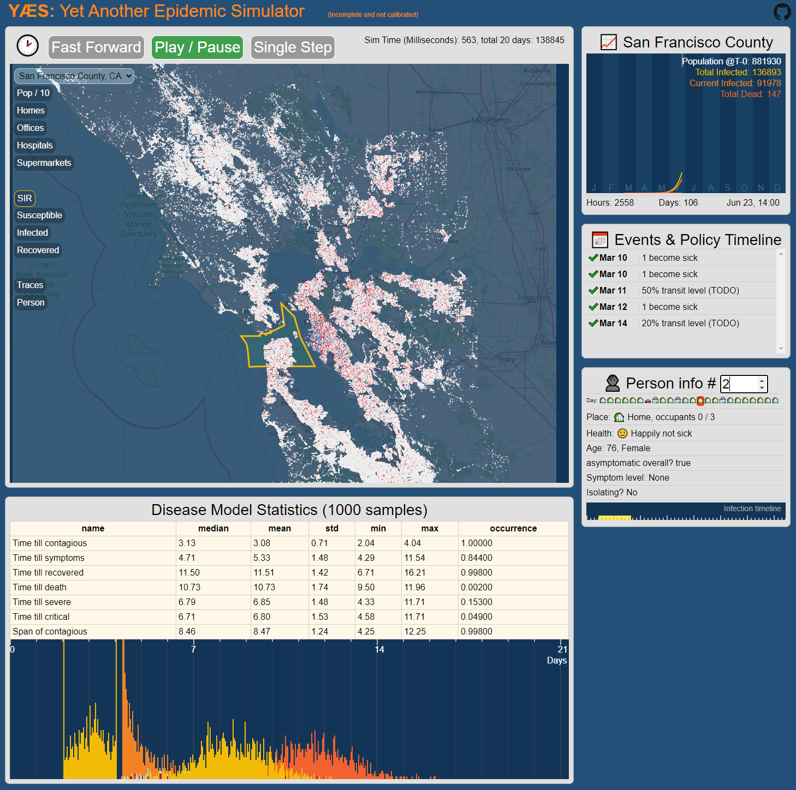

# YÆS: Yet Another Epidemic Simulator
This project is incomplete and uncalibrated. It should not be used for anything real. Seriously.

https://yaes.live



This project is an attempt to simulate COVID-19 spreading in a major metropolitan area. It is an experiment.

The simulation loads county-level populations with the correct population and some demographic data. The people in the simulation spend their days going between places, where they spread the virus to other occupants of the places based on a simple density formula.

Santa Cruz is the location I use to debug because it's small and I know the place, but the 9-county San Francisco bay area also works. To run that, get the code and change 'defaultPlace' in utils/mapBounds.js.

## Building and running on localhost

First install dependencies:  
Install node.js: https://nodejs.org/en/download/
```sh
npm install
```

To build and run:

```sh
npm start
```

To create a production build and deploy (need access for deploy):

```sh
npm run build-prod
npm run deploy
```

## Utils and data processing pipeline
Put all these big downloaded files in the sourceData folder. **TODO:** automate the downloading with a script???

Get northern california OpenStreetMaps data (norcal-latest.osm.pbf) here: http://download.geofabrik.de/north-america/us/california/norcal.html  
Use openstreetmapFilter.js to filter out the relevant region (lat/lon bounds set in code) and find buildings of interest, like businesses, hospitals, supermarkets.  

Get Facebook population density maps here: https://data.humdata.org/dataset/united-states-high-resolution-population-density-maps-demographic-estimates  
filename that includes california: population_usa28_-130_2019-07-01.tif  
Optional: Use QGIS software to export a layer inside of the lat/lon bounds.  
geotiff.js will later be used to export a people positions file from the population density data.  

County data from here: https://public.opendatasoft.com/explore/dataset/us-county-boundaries/export/?q=santa+clara  
Download geojson, whole dataset.  
It will be used by processBuildings.js to put each house in a county.  

Define counties to include in utils/mapBounds.js.

Download census CSV files here: https://www.census.gov/quickfacts/fact/table/sanfranciscocountycalifornia/HCN010212  
Get whatever counties are relevant and put the CSVs in sourceData/  
Name them like this... 'QuickFacts_santaclaracountycalifornia.csv'  

American Community Survey data from here: https://www2.census.gov/programs-surveys/acs/data/archive/2004/  
File: Profiles0502004.csv  
American community survey is older than the standard census data, but has some extra info.  

For maps, I take a screenshot from openstreetmap.org by going to 'Export', then putting in the lat/lon, then go to 'share' icon and set custom dimensions and export an image. There's probably a much better way to do this. :)  

To do the whole preprocess, first set the 'defaultPlace' in utils/mapBounds.js. Then (from project root folder) run:
```sh
node preprocessScript.js
```
If you run out of memory on larger regions, increase the memory with the '-big' command-line parameter:
```sh
node preprocessScript.js -big
```

-----------------------

For large map areas, like major metro areas, you might run out of memory. In openstreetmapFilter.js, turn on noCacheHack. Then use this cmd-line for extra memory. I'm not sure 16 gigs is actually needed, so that might be able to be trimmed down.

```sh
node --max-old-space-size=16384 openstreetmapFilter.js
node --max-old-space-size=16384 processBuildings.js
```

-----------------------
#### Flatbuffers
Flatbuffers are now being used instead of json for some things. They are binary, maybe faster, smaller files, and should let me do big files. They are not as easy to use as json. :/ They require flatbuffer schema files to define the file format. To get the flatbuffer compiler the easy way, go here:  
https://github.com/google/flatbuffers/releases  
Documentation here:  
https://google.github.io/flatbuffers/flatbuffers_guide_tutorial.html  
Call the compiler for each file like this:  
```
..\..\flatc.exe --js households.fbs
```
or: (windows specific because of lame file path backslash)  
```
npm run build-flatbuffers
```

-----------------------
#### Emscripten
The C++ -> Wasm works except for a few things. It's about 2x-3x speed.  
You can either run the script in the sim_backends folder or (for Windows) use this command line:
```
emcc --js-library lib.js --closure 1 --llvm-lto 1 --profiling --bind -s WASM=1 -s DISABLE_EXCEPTION_CATCHING=0 -s ASSERTIONS=1 -O3 -s EXPORT_ES6=1 -s MODULARIZE=1 -s USE_ES6_IMPORT_META=0 -s ALLOW_MEMORY_GROWTH=1 -s WASM_MEM_MAX=2000Mb -o ../../src/generated_wasm/resident_counter.js resident_counter.cc
```

#### Currently hosted on Google cloud storage as a static site
https://cloud.google.com/storage/docs/hosting-static-website#gsutil_1  
To list gcloud accounts:  
gcloud auth list  
To login a new user:  
gcloud auth login  
To set the active account, run  
gcloud config set account <account>  

To sync all files:  
gsutil rsync -R dist gs://www.yaes.live  
OR (without CDN cache):  
gsutil -m -h "Cache-Control:no-cache" rsync -R dist gs://www.yaes.live  
To set permissions to public for all files:  
gsutil iam ch allUsers:objectViewer gs://www.yaes.live  

Set index.html as default and a 404 page:  
gsutil web set -m index.html -e 404.html gs://www.yaes.live  


# Contributors

So far, this was written mostly by [Otavio Good](https://github.com/otaviogood), with help from [Francesco Rossi](https://github.com/redsh).  
Otavio's email is the same as my github username, but @yahoo.com. I suck at email though.  


Initially made with [createapp.dev](https://createapp.dev/)

